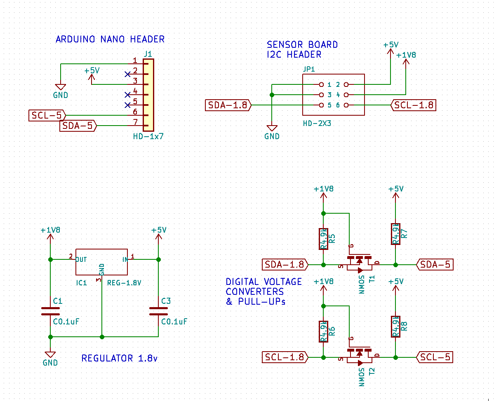
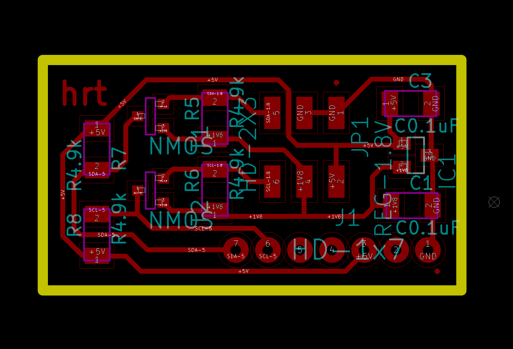

# Privacy Seed - Heart rate sensor nano shield

KiCAD shield shield for Arduino Nano to connect a [heart rate sensor board](https://github.com/iliasbartolini/privacy-seed-heartrate-sensor-board).
This component is part of the [Privacy Seed](https://privacy-seed.org/) project.

## Schema

## PCB

